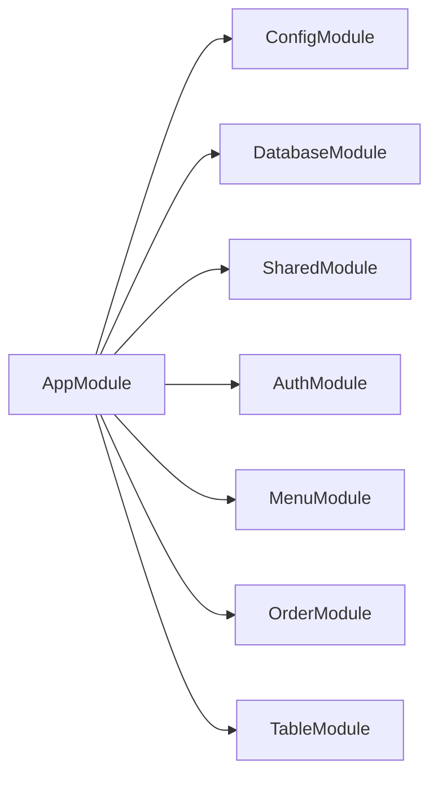

# Case Study: Cấu trúc thư mục & tổ chức Module (NestJS)

## 1. 📖 Tóm tắt Case Study

Đây là cách **chia ranh giới trách nhiệm** trong một backend lớn: đặt code “nền tảng” (HTTP adapter, filter, interceptor) ở `common/`, “hạ tầng dùng chung” (DB, Redis, logger) ở `shared/`, và **miền nghiệp vụ** theo từng thư mục trong `modules/`. Mục tiêu hệ thống: dễ tìm file, giảm coupling, và mỗi feature có thể phát triển độc lập (controller → service → entity/DTO).

Với quán cà phê, bạn sẽ có các module như `menu`, `order`, `table`, `staff`, `inventory` — cùng một pattern với `user`, `auth` trong dự án mẫu.

---

## 2. 🔍 Cách `spark-backend` triển khai (The Reference)

### Luồng hoạt động

1. `main.ts` khởi tạo ứng dụng Nest và gắn adapter Fastify, pipe, interceptor toàn cục.
2. `AppModule` là **composition root**: import `ConfigModule`, `SharedModule`, `DatabaseModule`, rồi lần lượt các module nghiệp vụ (`AuthModule`, `SystemModule`, …).
3. Các provider toàn cục (`APP_FILTER`, `APP_GUARD`, `APP_INTERCEPTOR`) được đăng ký **một lần** tại `AppModule`, áp dụng cho mọi route trừ khi decorator/metadata cho phép bỏ qua.

### File cốt lõi cần đọc

| Vai trò | Đường dẫn (trong `g:\spark-backend`) |
|--------|----------------------------------------|
| Composition root | `src/app.module.ts` |
| Bootstrap | `src/main.ts` |
| Shared infrastructure | `src/shared/shared.module.ts` |
| Adapter HTTP | `src/common/adapters/fastify.adapter.ts` |

### Đoạn code quan trọng

**`AppModule` — gom cấu hình và đăng ký cross-cutting concerns:**

```typescript
// spark-backend/src/app.module.ts
// Composition root: loads env config, shared infra, then feature modules.
// APP_FILTER / APP_INTERCEPTOR / APP_GUARD apply globally unless metadata opts out.

@Module({
  imports: [
    ConfigModule.forRoot({
      isGlobal: true,
      expandVariables: true,
      envFilePath: ['.env.local', `.env.${process.env.NODE_ENV}`, '.env'],
      load: [...Object.values(config)],
    }),
    SharedModule,
    DatabaseModule,
    AuthModule,
    SystemModule,
    // ... business modules
  ],
  providers: [
    { provide: APP_FILTER, useClass: AllExceptionsFilter },
    { provide: APP_INTERCEPTOR, useClass: TransformInterceptor },
    { provide: APP_GUARD, useClass: JwtAuthGuard },
    { provide: APP_GUARD, useClass: RbacGuard },
  ],
})
export class AppModule {}
```

---

## 3. ☕ Ứng dụng vào `chalo-be` (The Application)

- **Giữ nguyên tư duy**: `common/` = không biết “quán cà phê”; `modules/` = biết “order”, “menu”.
- **Tùy biến**: Spark có nhiều module social (`chat`, `matching`) — **Chalo không cần** ở MVP. Thay bằng module theo quy trình quán: bàn → gọi món → thanh toán → báo cáo ca.
- **Roles**: Spark dùng `admin` / `user` + permission string; Chalo nên thiết kế sớm: `OWNER`, `MANAGER`, `BARISTA`, `CASHIER` (có thể map sang permission giống Spark hoặc đơn giản hóa role-only cho giai đoạn đầu).

**Flow đề xuất cho Chalo:**



---

## 4. 🛠️ Hướng dẫn thực hành (Step-by-step Implementation)

> **Mục tiêu:** Bạn tự tạo file/thư mục và gõ code; đoạn dưới là **minh họa đầy đủ luồng**, có thể điều chỉnh tên biến cho khớp `chalo-be` của bạn.

### Step 1 — Tạo cây thư mục chuẩn (empty folders + placeholder nếu cần)

Trong PowerShell (tại root `chalo-be`):

```powershell
New-Item -ItemType Directory -Force -Path @(
  "src/common/filters",
  "src/common/interceptors",
  "src/common/decorators",
  "src/common/exceptions",
  "src/common/model",
  "src/shared/database",
  "src/shared/logger",
  "src/config",
  "src/modules/auth",
  "src/modules/menu/dto",
  "src/modules/menu/entities"
) | Out-Null
```

**Quy tắc đặt code:**

| Đường dẫn | Chỉ chứa |
|-----------|----------|
| `common/*` | HTTP cross-cutting: filter, interceptor, decorator, model response — **không** import `MenuService` |
| `shared/*` | Hạ tầng: DB module, logger module — được nhiều feature dùng |
| `config/*` | `registerAs` đọc env |
| `modules/<feature>/*` | Nghiệp vụ: controller → service → entity/dto |

### Step 2 — `AppModule` là composition root (minh họa từng lớp import)

Thứ tự khuyến nghị khi bạn làm dần các case study: `ConfigModule` → `DatabaseModule` → `AuthModule` → module nghiệp vụ. Dưới đây là ví dụ **khi bạn đã có đủ các module** (bạn có thể comment phần chưa làm):

```typescript
// chalo-be/src/app.module.ts
import { Module } from '@nestjs/common';
import { ConfigModule } from '@nestjs/config';
import { APP_FILTER, APP_GUARD, APP_INTERCEPTOR } from '@nestjs/core';

import configLoaders from './config';
import { DatabaseModule } from './shared/database/database.module';
import { AuthModule } from './modules/auth/auth.module';
import { MenuModule } from './modules/menu/menu.module';
// import { AllExceptionsFilter } from './common/filters/all-exceptions.filter';
// import { TransformInterceptor } from './common/interceptors/transform.interceptor';
// import { JwtAuthGuard } from './modules/auth/guards/jwt-auth.guard';
// import { RbacGuard } from './modules/auth/guards/rbac.guard';

@Module({
  imports: [
    ConfigModule.forRoot({
      isGlobal: true,
      expandVariables: true,
      envFilePath: ['.env.local', `.env.${process.env.NODE_ENV ?? 'development'}`, '.env'],
      load: configLoaders,
    }),
    DatabaseModule,
    AuthModule,
    MenuModule,
  ],
  controllers: [],
  providers: [
    // Khi làm case 06+: đăng ký global filter / interceptor / guard tại đây
    // { provide: APP_FILTER, useClass: AllExceptionsFilter },
    // { provide: APP_INTERCEPTOR, useClass: TransformInterceptor },
    // { provide: APP_GUARD, useClass: JwtAuthGuard },
    // { provide: APP_GUARD, useClass: RbacGuard },
  ],
})
export class AppModule {}
```

**Việc bạn cần làm thủ công:** Tạo `src/config/index.ts` export mảng `configLoaders` (case 02). Nếu chưa có `DatabaseModule`, **đừng** import — chỉ giữ `ConfigModule` + `MenuModule` để `nest start` vẫn chạy.

### Step 3 — Feature module `menu` (controller mỏng, service dày)

**3a. Module** — `exports: [MenuService]` để module khác (vd. `OrderModule`) inject được `MenuService`.

```typescript
// chalo-be/src/modules/menu/menu.module.ts
import { Module } from '@nestjs/common';
import { MenuController } from './menu.controller';
import { MenuService } from './menu.service';
// Sau case 03: import { TypeOrmModule } from '@nestjs/typeorm';
// import { MenuItemEntity } from './entities/menu-item.entity';

@Module({
  imports: [
    // TypeOrmModule.forFeature([MenuItemEntity]),
  ],
  controllers: [MenuController],
  providers: [MenuService],
  exports: [MenuService],
})
export class MenuModule {}
```

**3b. Controller** — chỉ nhận HTTP, gọi service, trả kết quả (sau case 06 có thể bọc envelope).

```typescript
// chalo-be/src/modules/menu/menu.controller.ts
import { Controller, Get } from '@nestjs/common';
import { MenuService } from './menu.service';

@Controller('menu')
export class MenuController {
  constructor(private readonly menuService: MenuService) {}

  @Get()
  findAll() {
    return this.menuService.findAll();
  }
}
```

**3c. Service** — toàn bộ rule “món có còn bán không”, “giá > 0”… đặt ở đây, không đặt trong controller.

```typescript
// chalo-be/src/modules/menu/menu.service.ts
import { Injectable } from '@nestjs/common';

@Injectable()
export class MenuService {
  // Sau case 03: constructor(@InjectRepository(MenuItemEntity) private readonly repo: Repository<MenuItemEntity>) {}

  async findAll() {
    // Minh họa: tạm trả mảng rỗng hoặc mock; sau này: return this.repo.find({ where: { isActive: true } });
    return [];
  }
}
```

### Step 4 — Kiểm tra chạy được

```bash
cd g:\Chalo\chalo-be
pnpm run start:dev
# hoặc npm run start:dev
```

Gọi thử: `GET http://localhost:<PORT>/<globalPrefix nếu có>/menu` — sau khi có prefix (case 09) URL sẽ là `/api/menu`.

### Step 5 — Ghi quy ước 5 dòng vào `README.md` hoặc `docs/CONVENTIONS.md`

Ví dụ nội dung bạn tự viết:

- Feature mới → thư mục dưới `src/modules/<name>`.
- Không đặt query TypeORM trong controller.
- DTO một file một use case (`create-*.dto.ts`, `update-*.dto.ts`).

**Kiểm tra cuối §4:** File mới thuộc `common` hay `modules`? Controller có đang nhồi SQL/if lồng nhau không? `AppModule` có đang import vòng (A import B import A)?

---

## 5. ✅ Todo checklist (đánh dấu khi xong / nhờ review)

**Cách dùng:** Khi code xong phần này, bạn tự đổi `[ ]` → `[x]`, hoặc nhờ AI review (gửi kèm **số case 01** + link commit / diff / mô tả file đã tạo) để cập nhật checklist trong file này.

_Review codebase `chalo-be` (snapshot):_

- [ ] Tạo khung thư mục `src/common/*` và `src/modules/*` theo tài liệu — _mới có `common/adapters`, `global`, `modules/menu`; chưa có `filters`, `interceptors`, `model`, …_
- [x] `AppModule` import được ít nhất `ConfigModule` hoặc module placeholder (app chạy `nest start`) — _đang import `MenuModule`, app boot được_
- [x] Có ít nhất **một** feature module mẫu (vd. `menu` hoặc tên domain bạn chọn): `*.module.ts`, `*.controller.ts`, `*.service.ts`
- [x] Controller chỉ gọi service, không chứa business rule nặng — _controller chưa có route nhưng chỉ inject `MenuService`_
- [ ] Quy ước đặt tên file/module thống nhất trong team (ghi 1 dòng vào `README` hoặc `docs` nếu cần) — _README vẫn template Nest mặc định_
